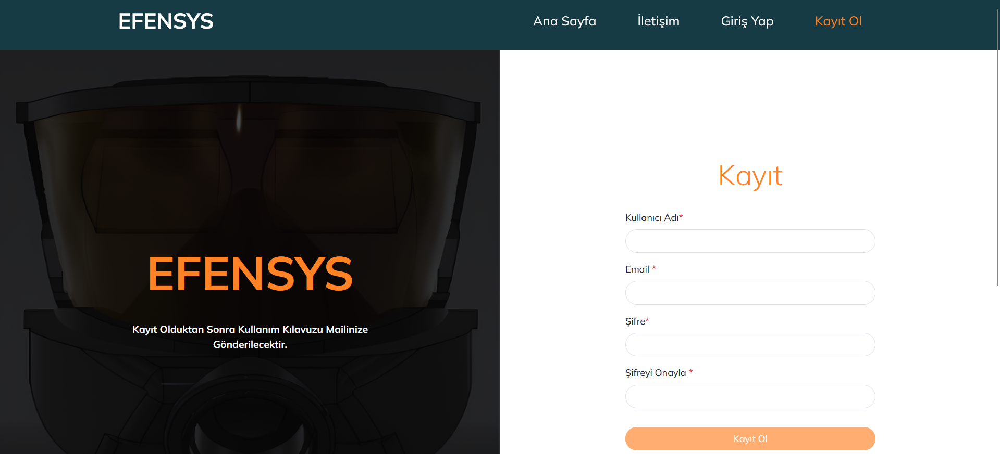
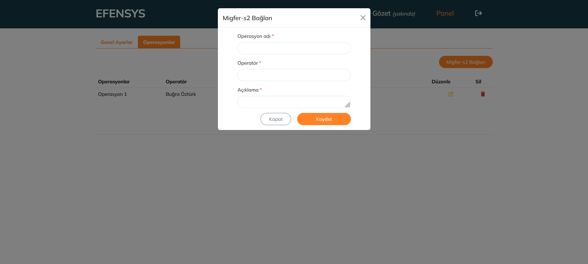
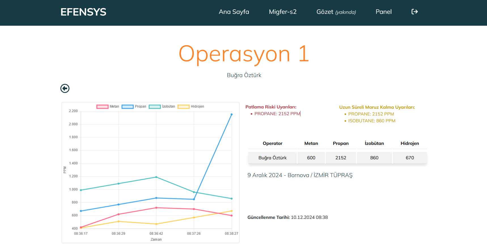
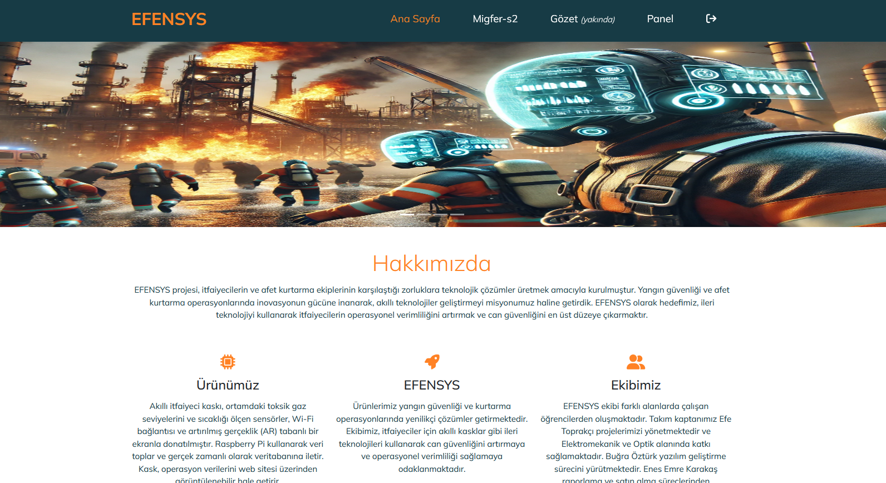

# EFENSYS - Command Control System for Disaster and Fire Management

EFENSYS is a command-control web application developed using the MEVN stack (MongoDB, Express.js, Vue3 Options API, Node.js). The system processes sensor data from helmets equipped with Raspberry Pi and provides real-time monitoring to disaster and fire teams. It can generate early warnings for potential risks, ensuring better safety and situational awareness.

---

## Features
- **Real-Time Monitoring:** Visualizes data collected from sensors in the field.
- **Risk Alerts:** Alerts for explosive gas levels and long-term exposure risks.
- **Responsive Design:** Built with Bootstrap for optimal user experience on all devices.
- **Authentication:** JWT-based user authentication for secure access.

---

## Technologies Used
- **Frontend:** Vue.js (Options API), Bootstrap 5
- **Backend:** Node.js, Express.js
- **Database:** MongoDB Atlas
- **IoT Integration:** Raspberry Pi (sensor data processing)

---

## Current Issues
- **WebSocket Integration:** Real-time synchronization with IoT devices is not yet implemented. WebSocket.io integration is needed.
- **JWT Authentication:** Some inconsistencies in token validation need to be addressed.

---

## Installation

### Prerequisites
- Node.js and npm installed
- MongoDB Atlas account or local MongoDB setup

### Steps
1. **Clone the repository:**
   ```bash
   git clone https://github.com/Bugra-Ozturk/EFENSYS.git

## Screenshots


### 1. Register Page
The registration page for new users.



---

### 2. Login Page
The login page for user authentication.


---

### 3. Launch Panel
Operation launch panel



---

### 4. Operation Page
This page provides real-time monitoring of operations and sensor data.



---

### 5. Home Page
The main dashboard displaying the system overview.



### Contact 
-You can contact me at bugrao7turk@gmail.com 
