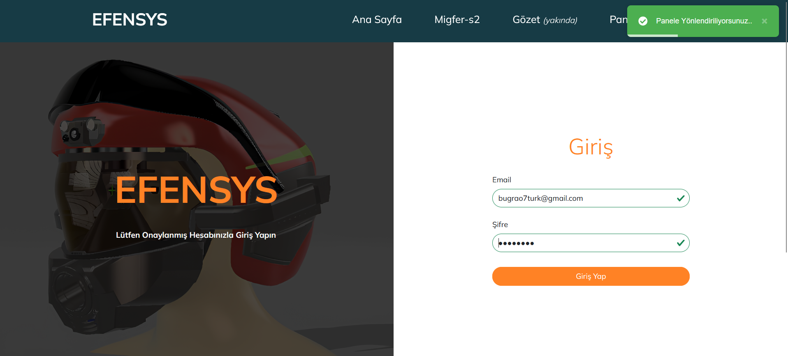

# 🌟 EFENSYS - Command Control System for Disaster and Fire Management 🌟

EFENSYS is a command-control web application developed using the MEVN stack (MongoDB, Express.js, Vue3 Options API, Node.js). The system processes sensor data from helmets equipped with Raspberry Pi and provides real-time monitoring to disaster and fire teams. It can generate early warnings for potential risks, ensuring better safety and situational awareness.

---

## Features
- **Real-Time Monitoring:** Visualizes data collected from sensors in the field.
- **Risk Alerts:** Alerts for explosive gas levels and long-term exposure risks.
- **Responsive Design:** Built with Bootstrap for optimal user experience on all devices.
- **Authentication:** JWT-based user authentication for secure access.

---

## Technologies Used
- **Frontend:** Vue.js (Options API), Bootstrap 5
- **Backend:** Node.js, Express.js
- **Database:** MongoDB Atlas
- **IoT Integration:** Raspberry Pi (sensor data processing)

---

## Current Issues
- **WebSocket Integration:** Real-time synchronization with IoT devices is not yet implemented. WebSocket.io integration is needed.
- **JWT Authentication:** Some inconsistencies in token validation need to be addressed.

---

## Installation

### Prerequisites
- Node.js and npm installed
- MongoDB Atlas account or local MongoDB setup

### Steps
1. **Clone the repository:**
   ```bash
   git clone https://github.com/Bugra-Ozturk/EFENSYS.git
## Environment Variables

To run this project, you will need to add the following environment variables to your `.env` file:

```plaintext
JWT_SECRET_KEY=your_jwt_secret_key
JWT_EXPIRE_TIME=expiration_time_in_seconds
MONGODB_URI=your_mongodb_connection_string


## Usage Example

1. **User Login**  
   The user logs into the system using their credentials on the login page.

2. **Start an Operation**  
   Once logged in, the user navigates to the panel and starts an operation. Real-time data will begin to flow if you have a Raspberry Pi-powered smart helmet with sensors.  
   *(Don't have a high-tech helmet? Don't worry, you can simulate the experience with an HTTP client!)*

3. **Simulating Data via HTTP Client**  
   To test the system without a Raspberry Pi helmet, you can send a request using tools like **Postman** or **cURL**. Below is an example JSON payload you can send to simulate sensor data:

   ```json
   {
       "title": "Operation 1",
       "measurement": {
           "methane": 600,
           "propane": 2152,
           "isobutane": 860,
           "hydrogen": 670
       }
   }


## Screenshots


### 1. Register Page
The registration page for new users.


---

### 2. Login Page
The login page for user authentication.



---

### 3. Launch Panel
Operation launch panel


---

### 4. Operation Page
This page provides real-time monitoring of operations and sensor data.


---

### 5. Home Page


### Contact 
-You can contact me at bugrao7turk@gmail.com 
